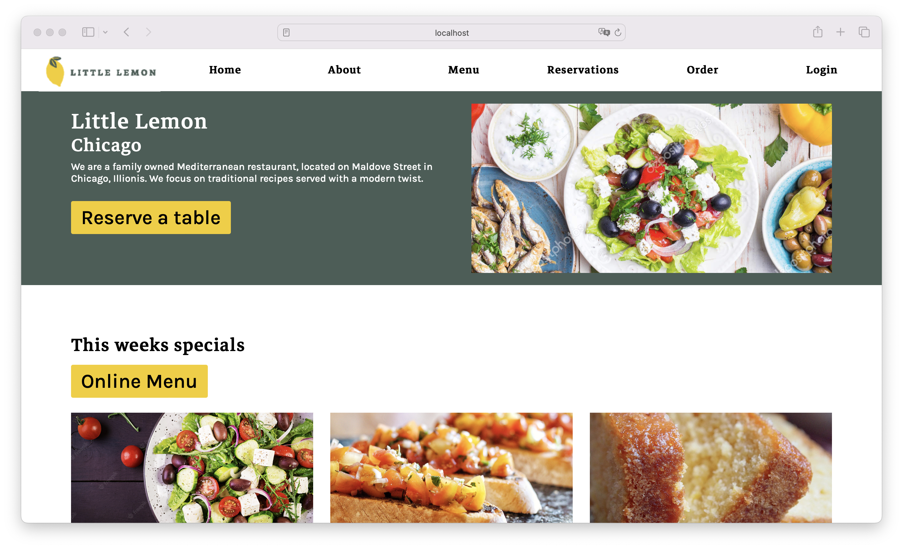
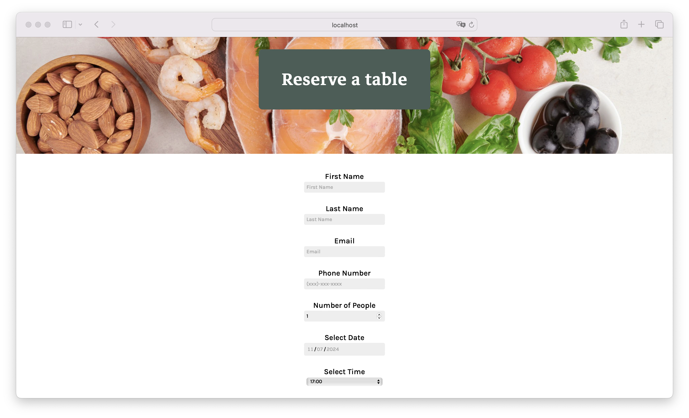

# Little Lemon Website

This project consists of the website for a restaurant called Little Lemon. The site showcases everything the restaurant offers, from the menu to information about the restaurant and special services. The main feature of the site is an online reservation system, allowing customers to quickly and easily book a table by providing basic information such as their first name, last name, email, phone number, number of people, reservation date and time, occasion, seating preferences, and additional comments. The purpose of this website is to make it easier for restaurant customers to view the restaurant's offerings and make table reservations online. It is designed to be used by anyone who wants to learn more about the restaurant and make a reservation conveniently and efficiently. This website aims to provide a user-friendly and efficient experience, helping Little Lemon manage its reservations and improve customer satisfaction.

## Screenshots




## Tech Stack

**Client:** HTML, CSS, JavaScript, React, NPM

## Prerequisites

Before you begin, ensure you have the following installed:

- **Node.js**: Little Lemon Website requires Node.js to run. You can download it from [nodejs.org](https://nodejs.org/).
- **Visual Studio Code (optional)**: You can download it from [Visual Studio Code](https://code.visualstudio.com/).

## Installation Steps

### Download the project:

1. Download the project from the repository or directly as a ZIP file.

### Clone the repository (alternative):

1. Clone the repository to your local machine:

   ```bash
   git clone https://github.com/jorgedoiany/little-lemon-website.git

   ```

2. Navigate into the project directory:

   ```bash
   cd little-lemon-website
   ```

### Install dependencies:

1. Install the necessary dependencies using npm:

   ```bash
   npm install
   ```

## Running the Application

### Start the development server:

1. To start Little Lemon Website in development mode, run:

   ```bash
   npm start

   ```

2. Open your browser and navigate to http://localhost:3000 to view ChronoTimer.

### Build for production:

1. To build Little Lemon Website for production, use:

   ```bash
   npm run build
   ```

This command bundles the app into static files for deployment.

## Additional Notes

- Make sure you have Node.js installed globally on your machine.
- If you prefer, you can use Visual Studio Code for editing the codebase.
- You can also download the project directly as a ZIP file from the repository.
- This project uses npm to manage dependencies and run scripts.
- For more information on React, visit [reactjs.org](https://react.dev/).

That's it! You should now be able to see and use the **Little Lemon** website in your browser.

## Author

- [@jorgedoiany](https://github.com/jorgedoiany)
